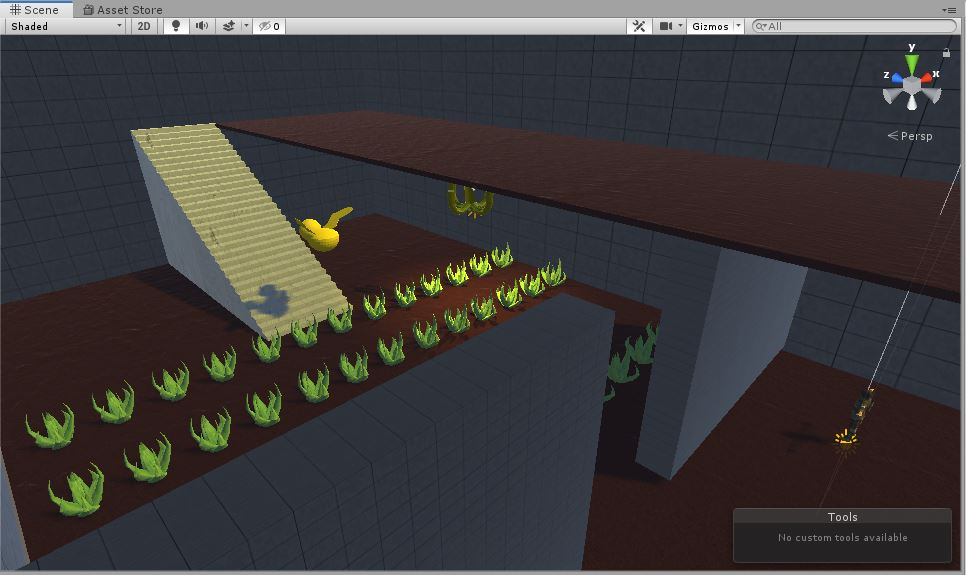
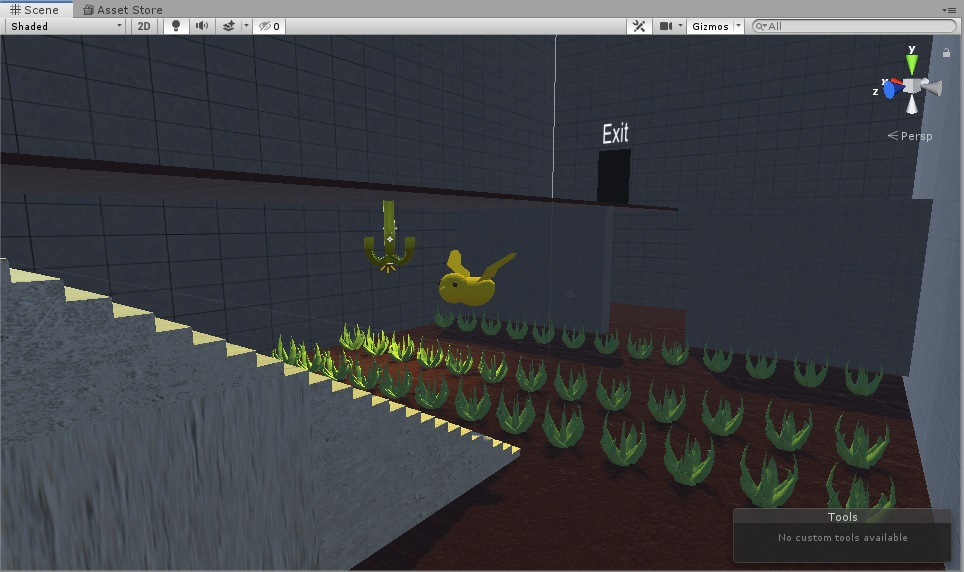

# Prototipo "Jet Set Willy" en 3D usando Unity (2019.2.12f1).

## Capturas

# Imagen de la escena en el juego original:

# Notas:
Recordatorio: El componente Character Controller de Unity no se lleva bien con los planos (Objeto 3D "plane"). La colisión del personaje se bugea y aparece separado del suelo unos centímetros.
Es conveniente usar boxes y no planos. Así sale todo perfecto :)
